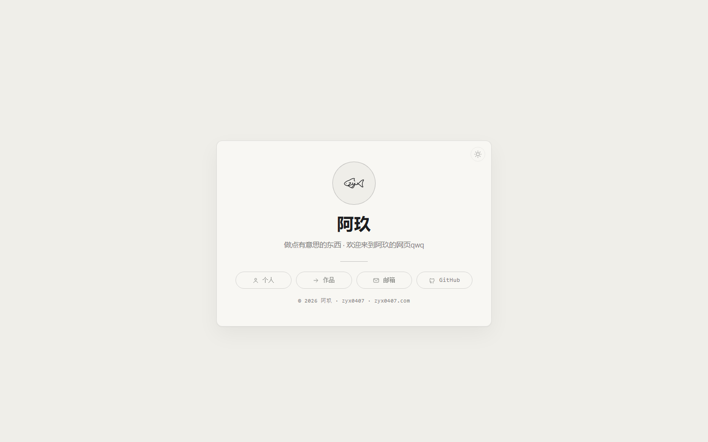

# zyx0407.com

阿玖（zyx0407）的个人主页：**一张卡片的门面** —— 圆形鱼标头像、名号、一行自己的话、四个入口（个人 / 作品 / 邮箱 / GitHub），每个入口一个副页。

纯静态、零构建、零第三方库：放在 GitHub Pages 上就能跑，本地双击 `index.html` 也能看。

## 改内容

所有文字都在 `site-data.js`（名号 / 一句话 / 关于我 / 联络 / 作品清单 / 卡片上的四个入口）。
作品详情页 `work\<slug>\index.html` 由 `node build.mjs` 依据 `site-data.js` 生成。

## 结构

| 路径 | 是什么 |
| --- | --- |
| `index.html` | 主页（居中卡片） |
| `about/` `work/` `mail/` | 个人 / 作品 / 邮箱三个副页 |
| `style.css` `theme.js` | 样式与主题：暖纸 / 深夜两态，跟随系统、也能手动切 |
| `render.js` `site-data.js` | 数据 → 页面 |
| `build.mjs` | 生成作品详情页 |
| `assets/` | 鱼标（连笔 SVG）、写出动画、favicon |
